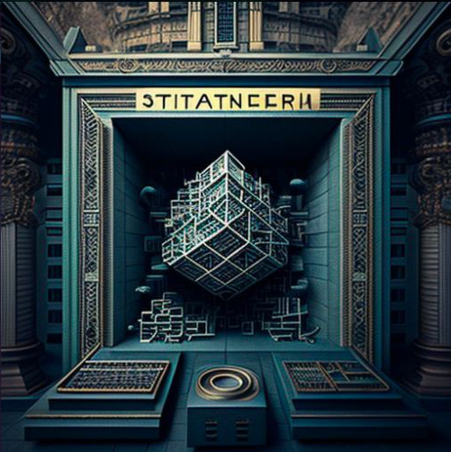

# Syther Project

Just wrapping SNX with a few extra features, getting ready for Synthetix V3.



## Features

- Start fresh, with Synthetix V3

## Getting Started

Clone the repo and contribute!

Install dependencies:

```bash

npm install

```

This project requires [Cannon](https://usecannon.com/), review the [Get Started](https://usecannon.com/get-started) guide.

```bash
npm i -g @usecannon/cli
```

And start an instance of a Cannon node with deployed Synthetix V3 contracts in a separate terminal:

```bash
cannon synthetix-sandbox
```

## Basic Flow

Basic Flow:

    User -> AMMPool: SNX
    User <- AMMPool: sySNX
    User -> MainSyther.sol: SNX
    MainSyther.sol -> User: sySNX
    MainSyther.sol -> SNX Staking: SNX
    MainSyther.sol <- SNX Staking: snxUSD
    MainSyther.sol -> InvestModule.sol: snxUSD
    MainSyther.sol -> AMMPool: SNX
    MainSyther.sol <- AMMPool: sySNX
    User -> AMMPool: sySNX
    User <- AMMPool: SNX

```javascript

 ┌────┐┌───────┐┌──────────────┐┌───────────┐┌────────────────┐
 │User││AMMPool││MainSyther.sol││SNX Staking││InvestModule.sol│
 └─┬──┘└───┬───┘└──────┬───────┘└─────┬─────┘└───────┬────────┘
   │       │           │              │              │
   │  SNX  │           │              │              │
   │──────>│           │              │              │
   │       │           │              │              │
   │ sySNX │           │              │              │
   │<──────│           │              │              │
   │       │           │              │              │
   │       │SNX        │              │              │
   │──────────────────>│              │              │
   │       │           │              │              │
   │       sySNX       │              │              │
   │<──────────────────│              │              │
   │       │           │              │              │
   │       │           │     SNX      │              │
   │       │           │─────────────>│              │
   │       │           │              │              │
   │       │           │    snxUSD    │              │
   │       │           │<─────────────│              │
   │       │           │              │              │
   │       │           │           snxUSD            │
   │       │           │────────────────────────────>│
   │       │           │              │              │
   │       │    SNX    │              │              │
   │       │<──────────│              │              │
   │       │           │              │              │
   │       │   sySNX   │              │              │
   │       │──────────>│              │              │
   │       │           │              │              │
   │ sySNX │           │              │              │
   │──────>│           │              │              │
   │       │           │              │              │
   │  SNX  │           │              │              │
   │<──────│           │              │              │
 ┌─┴──┐┌───┴───┐┌──────┴───────┐┌─────┴─────┐┌───────┴────────┐
 │User││AMMPool││MainSyther.sol││SNX Staking││InvestModule.sol│
 └────┘└───────┘└──────────────┘└───────────┘└────────────────┘


```

Deposit Flow:

```javascript

"SNX Deposit";

if ("Collateralization Ratio above Threshold?") {
 "Deposit in Staking";
 "Mint snxUSD";
} else {
  if("Collateralization Ratio reaches dangerous Threshold?") {
    "Deposit in Staking";
    "Check if need to burn some to get above danger zone";
  } else {
    "Deposit in SNX Yield Contract";
  }
}

"Done";

         ┌───────────┐
         │SNX Deposit│
         └─────┬─────┘
     __________▽___________
    ╱                      ╲                                   ┌──────────────────┐
   ╱ Collateralization      ╲__________________________________│Deposit in Staking│
   ╲ Ratio above Threshold? ╱yes                               └─────────┬────────┘
    ╲______________________╱                                       ┌─────▽─────┐
               │no                                                 │Mint snxUSD│
  _____________▽______________                                     └─────┬─────┘
 ╱                            ╲        ┌──────────────────┐              │
╱ Collateralization Ratio      ╲_______│Deposit in Staking│              │
╲ reaches dangerous Threshold? ╱yes    └─────────┬────────┘              │
 ╲____________________________╱    ┌─────────────▽────────────┐          │
               │no                 │Check if need to burn some│          │
       ┌───────▽──────┐            │to get above danger zone  │          │
       │Deposit in SNX│            └─────────────┬────────────┘          │
       │Yield Contract│                          │                       │
       └───────┬──────┘                          │                       │
               └───────────────┬─────────────────┴───────────────────────┘
                            ┌──▽─┐
                            │Done│
                            └────┘


```

## Contracts

- `MainSyther.sol` - Main contract for the project, is used to deposit SNX and mint snxUSD
  - Creates an account with the Synthetix Staking contract
  - Is used to mint sySNX with SNX
  - Contract stakes SNX in the Synthetix Staking contract and mints snxUSD
  - Contract invests snxUSD in the InvestModule contract
  - Periodically, contract withdraws snxUSD from the InvestModule contract and burns snxUSD for SNX
  - Contract swaps SNX for sySNX to keep the ratio of sySNX to SNX constant
- `InvestModule.sol` - Contract that manages snxUSD and invests it to other protocols to earn a yield
- AMMPool - Third party Automated Market Maker contract, could be curve that pairs sySNX with SNX
  - Is used to swap SNX for sySNX (entering a position)
  - Is used to swap sySNX for SNX (exiting a position)

## TODO

- [x] Create MainSyther.sol file
- [ ] Do the rest

```

```
